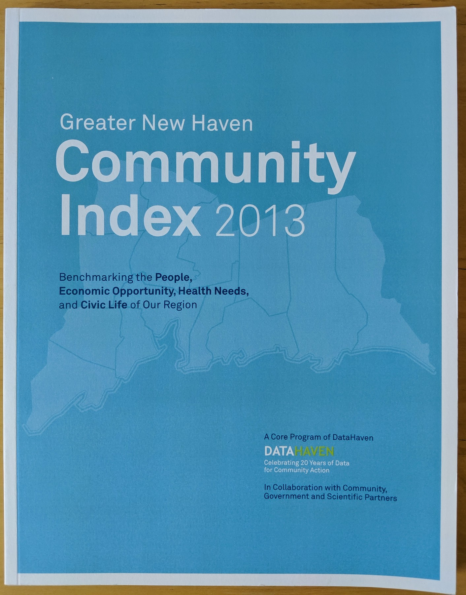
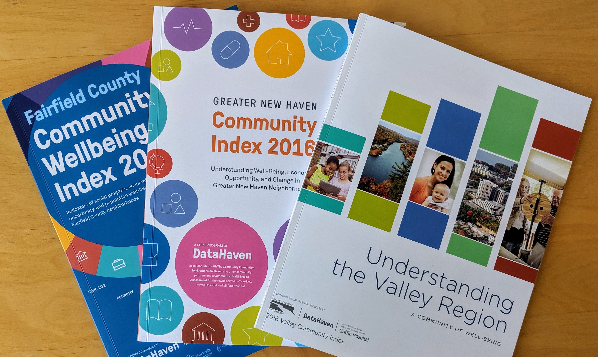
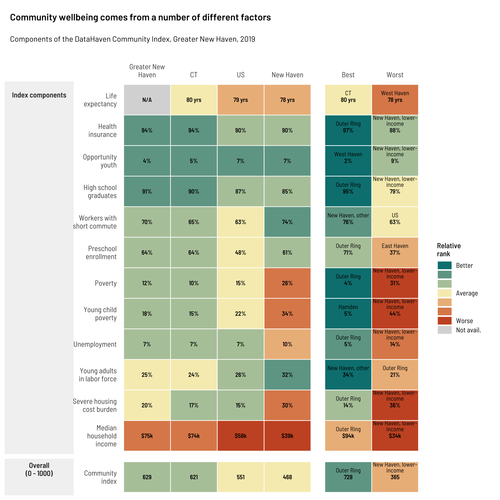
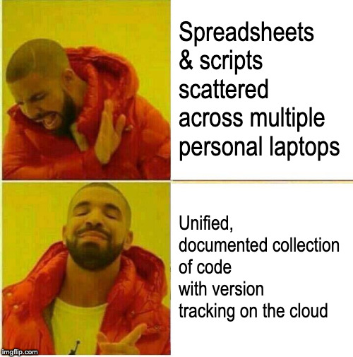
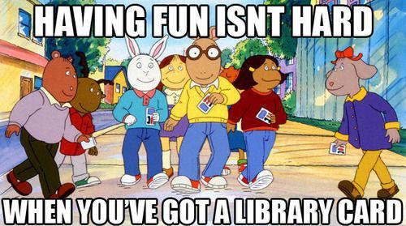
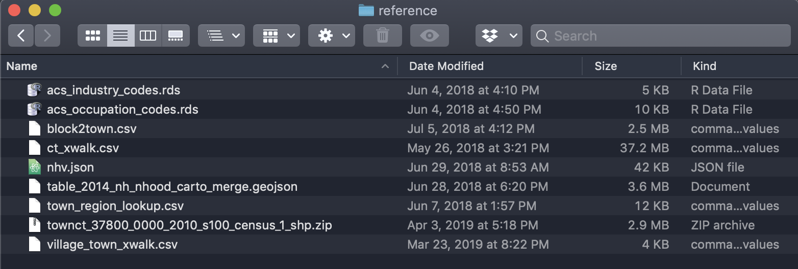
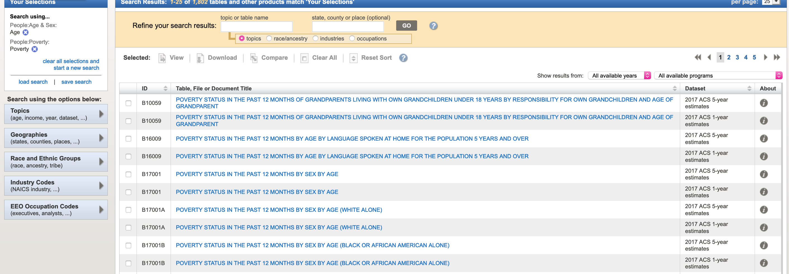
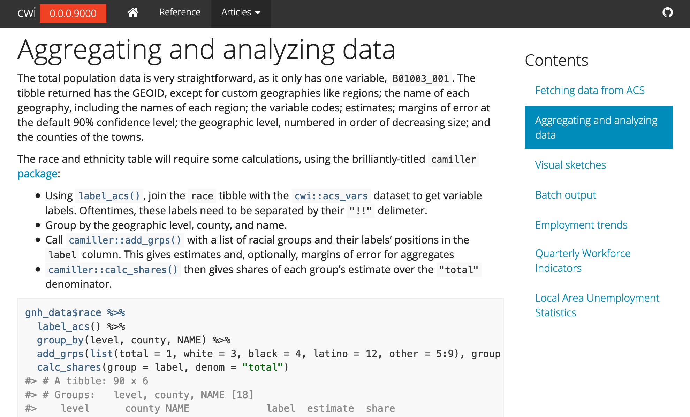

```{r setup, include=FALSE}
knitr::opts_chunk$set(
	echo = FALSE,
	message = FALSE,
	warning = FALSE,
	fig.showtext = T,
	dpi = 600
)
options(htmltools.dir.version = FALSE)
```

```{r xaringan-themer, include=FALSE}
library(xaringanthemer)
mono_accent(
  base_color = "#7E0696",
  white_color = "#eeeeee",
  inverse_background_color = "#673870",
  text_font_family = "'Barlow'",
  header_font_family = "'Barlow Semi Condensed'",
  code_font_family = "'Fira Code'",
  text_font_base = "sans",
  text_font_size = "24px",
  header_font_weight = 600,
  header_h1_font_size = "56px",
  header_h2_font_size = "46px",
  padding = "0.8em 2em 0.8em 2em",
  code_font_size = "0.85em",
  table_row_even_background_color = "#eeeeee"
)
```

```{r include=FALSE}
library(tidyverse)
library(tidycensus)
library(camiller)
library(cwi)
library(showtext)
library(sf)
library(patchwork)
library(lubridate)
```

```{r include=FALSE}
font_add_google("Barlow Semi Condensed", "barcond")
showtext_opts(dpi = 300)
showtext_auto()
tol12 <- ggthemes::ptol_pal()(12)
pastel <- rcartocolor::carto_pal(12, "Pastel")
theme_src <- function(...) {
  theme_din(base_size = 16, base_family = "barcond", ...) +
    theme(legend.text = element_text(size = rel(0.7)))
}
theme_set(theme_src())
```

# DataHaven's Community Index

.col3-pad[
#### 2013



] 

.col3-pad[
#### 2016



]

.col3-pad[
#### 2019: the takeover



]

---

# Spreadsheet sprawl

.pull-left[]

.pull-right[

### Installing packages is easy

```{r echo=TRUE, eval=FALSE}
install_github("camille-s/camiller")
install_github("CT-Data-Haven/cwi")
```


]

---

# Shifting my thinking: toward sustainable & reproduceable work

.pull-left[
  .big-text[
    Unhappy Mother's Day, but a new appreciation of behind-the-scenes information
  ]
]

.pull-right[]

---

# Shifting my thinking: toward sustainable & reproduceable work

.pull-left[
```{r move_map, fig.height=4, fig.width=5, echo=FALSE}
move_path <- readRDS("data/move_path.rds")
states_sf <- readRDS("data/states_sf.rds")
ggplot() +
  geom_sf(data = states_sf, fill = "#CADFE6", color = "#3D5775", size = 0.4) +
  geom_path(aes(x = X, y = Y, group = L1), data = move_path, color = "mediumorchid", size = 4, alpha = 0.9, arrow = arrow(type = "closed"), linejoin = "mitre") +
  coord_sf(ndiscr = 0) +
  labs(x = NULL, y = NULL)
```
]

.pull-right[
  .big-text[I moved 300 miles away to Baltimore]
]

---

# What's a library?



--

```{r echo=TRUE, eval=FALSE}
library(tidyverse)    # sets up LOTS of functions, how I start my mornings
library(tidycensus)   # fetches data from Census API
library(camiller)     # first in-house library
library(cwi)          # second in-house library 
library(showtext)     # use nice fonts in plots
library(sf)           # work with geospatial data & make maps
library(patchwork)    # layout plots together
library(lubridate)    # parse dates
```


---

# Functions! If only...

.small-text[
```{r echo=TRUE}
leave_the_house <- function(date = today(), biking = TRUE, working = TRUE) {
  day_of_week <- wday(date, label = TRUE, abbr = FALSE)
  always_need <- c("keys", "phone", "wallet", "meds")
  sometimes_need <- c()
  if (biking) {
    sometimes_need <- c(sometimes_need, "helmet")
  } else {
    sometimes_need <- c(sometimes_need, "bus card")
  }
  if (working) {
    sometimes_need <- c(sometimes_need, "laptop")
  }
  need <- c(always_need, sometimes_need)
  
  cat(
    sprintf("Happy %s! Today you need:", day_of_week), "\n",
    paste(need, collapse = ", ")
  )
}
```
]

---

# Functions! If only...

```{r echo=TRUE, comment=""}
leave_the_house(biking = FALSE, working = TRUE)
```


---

# Functions: reduce repetition & clutter

**Tedious and messy**

```{r fetch_income1, echo=TRUE, eval=FALSE}
income_us <- get_acs("us", table = "B19013", year = 2017)
income_state <- get_acs("state", table = "B19013", year = 2017)
income_msa <- get_acs("metropolitan statistical area/micropolitan statistical area", table = "B19013", year = 2017)
income_county <- get_acs("county", table = "B19013", state = "09", year = 2017)
income_towns <- get_acs("county subdivision", table = "B19013", state = "09", year = 2017)
income <- bind_rows(income_us, income_state, income_msa, income_county, income_towns)

# get rid of those extra tables
rm(income_us, income_state, income_msa, income_county, income_towns)
```

**Nice n clean**

```{r fetch_income2, echo=TRUE, eval=FALSE}
income <- multi_geo_acs(table = "B19013", year = 2017, us = TRUE, msa = TRUE)
```

---

# Functions: I *swear* I did this last week!

```{r}
income_tract <- readRDS("data/income_by_tract.rds")
poverty_tract <- readRDS("data/poverty_by_tract.rds")
gnh_sf <- town_sf %>%
  filter(name %in% regions$`Greater New Haven`)
```

```{r}
income_map <- tract_sf %>%
  inner_join(income_tract, by = "name") %>%
  ggplot() +
  geom_sf(aes(fill = brk), alpha = 0.9, size = 0.1, color = "white") +
  geom_sf(data = gnh_sf, fill = "transparent", size = 0.4, color = "gray10") +
  scale_fill_brewer(palette = "BuPu") +
  coord_sf(ndiscr = 0) +
  theme(legend.key.height = unit(1, "lines"),
        legend.key.width = unit(1.2, "lines")) +
  labs(fill = "Income",
       title = "Median household income by tract",
       subtitle = "Greater New Haven, 2017")

pov_map <- tract_sf %>%
  inner_join(poverty_tract, by = "name") %>%
  ggplot() +
  geom_sf(aes(fill = brk), alpha = 0.9, size = 0.1, color = "white") +
  geom_sf(data = gnh_sf, fill = "transparent", size = 0.4, color = "gray10") +
  scale_fill_brewer(palette = "GnBu") +
  coord_sf(ndiscr = 0) +
  theme(legend.key.height = unit(1, "lines"),
        legend.key.width = unit(1.2, "lines")) +
  labs(fill = "Rate",
       title = "Low-income rate by tract",
       subtitle = "Greater New Haven, 2017")
```

.left-column-67[
```{r map_nobrks1, fig.width=8, fig.height=5}
income_map
```
]


--

.right-column-33[
```{r map_brks1, fig.width=2.5, fig.height=1.5}
income_leg1 <- cowplot::get_legend(income_map +
    labs(fill = ":(") +
    theme(plot.margin = margin(0, 0, 0, 0, "pt"),
          legend.position = c(0, 0.5),
          legend.justification = c(0, 0.5)))
wrap_elements(income_leg1)
```
]

--
.right-column-33[
```{r map_brks2, fig.width=2.5, fig.height=1.5}
income_leg2 <- cowplot::get_legend(income_map +
      labs(fill = ":)") +
      scale_fill_brewer(palette = "BuPu", 
                    labels = function(x) brk_labels(x, format = "dollark", mult_by = 1e-3, round_digits = 0)) +
      theme(plot.margin = margin(0, 0, 0, 0, "pt"),
          legend.position = c(0, 0.5),
          legend.justification = c(0, 0.5)))
wrap_elements(income_leg2)
```
]

---

# Functions: make it scale


.left-column-67[
```{r map_nobrks2, fig.width=8, fig.height=5}
pov_map
```
]

--

.right-column-33[
```{r map_brks3, fig.width=2.5, fig.height=1.5}
pov_leg1 <- cowplot::get_legend(pov_map +
    labs(fill = ":(") +
    theme(plot.margin = margin(0, 0, 0, 0, "pt"),
          legend.position = c(0, 0.5),
          legend.justification = c(0, 0.5)))
wrap_elements(pov_leg1)
```
]

--

.right-column-33[
```{r map_brks4, fig.width=2.5, fig.height=1.5}
pov_leg2 <- cowplot::get_legend(pov_map +
    labs(fill = ":)") +
    scale_fill_brewer(palette = "GnBu",
                      labels = function(x) brk_labels(x, format = "percent", mult_by = 100, round_digits = 0)) +
    theme(plot.margin = margin(0, 0, 0, 0, "pt"),
          legend.position = c(0, 0.5),
          legend.justification = c(0, 0.5)))
wrap_elements(pov_leg2)
```
]

---

# Functions: encourage good habits

```{r}
tenure <- readRDS("data/tenure.rds") %>%
  rename(homeownership = share)
```

.pull-left[
```{r tenure_plot_code, echo=TRUE, eval=FALSE}
geo_level_plot(tenure, 
    value = homeownership, 
    hilite = "mediumpurple1", 
    title = "Homeownership rates, 2017")
```
]

.pull-right[
```{r tenure_plot, echo=FALSE, eval=TRUE, fig.height=6}
geo_level_plot(tenure, 
               value = homeownership, 
               hilite = "mediumpurple1", 
               title = "Homeownership rates, 2017")
```
]

---


# Clean, uniform charts

```{r plot_pair, fig.height=4.5, fig.width=10}
income_trend <- read_csv("data/1990_2017_median_hh_income_adjusted.csv") %>%
  select(year, level, name, income = adj_value) %>%
  filter(year %in% range(year)) %>%
  mutate(level = as_factor(level) %>%
           fct_relevel("state", "regions")) %>%
  mutate(dollar_lbl = scales::dollar(income, accuracy = 1, scale = 1e-3, suffix = "k"),
         lbl = if_else(year == max(year), paste(dollar_lbl, name), dollar_lbl),
         offset = if_else(year == min(year), year - 1, year + 1))

income_trend_line <- income_trend %>%
  filter(name %in% c("Connecticut", "Greater New Haven", "New Haven", "New Haven Inner Ring", "New Haven Outer Ring")) %>%
  ggplot(aes(x = year, y = income, color = name)) +
    # geom_smooth(se = F, method = loess, span = 0.2, alpha = 0.9, size = 1.6) +
    geom_line(size = 1.6, alpha = 0.9) +
    geom_point(size = 4, alpha = 0.9) +
    geom_text(aes(label = lbl, x = offset), 
              hjust = "outward", size = 3.2, fontface = "bold", family = "barcond") +
    scale_color_manual(values = colorspace::darken(pastel[c(1, 3, 4, 5, 6)], amount = 0.1)) +
    scale_y_continuous(breaks = NULL) +
    scale_x_continuous(expand = expand_scale(mult = c(0.15, 0.7)), breaks = c(1990, 2017)) +
    theme_src(xgrid = T, ygrid = F) +
    theme(legend.position = "none") +
    labs(x = NULL, y = NULL,
         title = "Median household income, 1990-2017",
         subtitle = "In 2017 dollars")

income_dots <- income_trend %>%
  filter(year == max(year), name %in% c(regions$`Greater New Haven`, "Connecticut", "Greater New Haven")) %>%
  mutate(name = as.factor(name) %>% fct_reorder(income)) %>%
  ggplot(aes(x = name, y = income, color = level)) +
    geom_point(size = 3.5) +
    coord_flip() +
    scale_y_continuous(labels = scales::dollar_format(accuracy = 1, scale = 1e-3, suffix = "k"), breaks = seq(4e4, 1.4e5, by = 2.5e4)) +
    scale_color_manual(values = c(towns = "#A37BE8", regions = "#514469", state = "#514469")) +
    theme_src(xgrid = T, ygrid = "dotted") +
    theme(legend.position = "none") +
    labs(x = NULL, y = "Income",
         title = "Median household income",
         subtitle = "Greater New Haven, 2017")

income_dots +
  income_trend_line +
  plot_layout(nrow = 1) &
  theme(plot.margin = margin(0.2, 0.4, 0.2, 0.4, "in"),
        plot.title = element_text(size = rel(1.1)))
```


---

# Reusable datasets & references

How many times can I generate, save, and forget about the same lookup tables and shapefiles?



.footnote[My old (stolen) laptop was even worse!]

---

# Reusable datasets & references

**Much better:** move those lookup tables & shapefiles to the R package

.pull-left[
```{r village, echo=TRUE, eval=FALSE}
head(village2town, n = 5)
```

```{r village_print, echo=FALSE, eval=TRUE}
head(village2town, n = 5) %>%
  knitr::kable(format = "html")
```

]

.pull-right[
```{r nhv_basic_map, echo=TRUE, fig.asp=0.7, fig.height=4}
plot(new_haven_sf["geometry"])
```
]

---

# Reusable datasets & references

Avoid the suffering of finding table numbers on FactFinder



---

# Reusable datasets & references

Avoid the suffering of finding table numbers on FactFinder

```{r echo=TRUE}
basic_table_nums[["pov_age"]]
```


```{r eval=FALSE, echo=TRUE}
get_acs("county", table = basic_table_nums[["pov_age"]], state = "09")
```


---

# Testing, debugging, documenting

### What doesn't kill you makes you stronger

* Does this function do what I *think* it does?
* Are these the most important tasks for me & my coworkers?
* What might break by this time next month?
* How will this scale & remain relevant?
* What am I not thinking of yet?

#### Testing the `qwi_industry` function in `cwi`:

.small-text[

```{r echo=TRUE, eval=FALSE}
test_that("handles years not in API", {
  expect_warning(qwi_industry(1990:2000, industries = "23"), "earlier years are being removed")
  expect_error(qwi_industry(1990:1994, industries = "23"), "only available")
  # should only return 1996-2000
  expect_equal(nrow(suppressWarnings(qwi_industry(1991:2000, industries = "23", annual = T))), 5)
})
```
]

---

# Testing, debugging, documenting

### What doesn't kill you makes you stronger

.pull-left[
* My code is amazing. Now how do I make sure someone uses it?
* If I can't explain a feature, do I really need it?
* What might someone else do wrong?
* How can I avoid "What does this do?" emails and texts?
]

.pull-right[
#### Docs website with `pkgdown`


]

---

background-image: url(img/sketchbook.jpg)
background-size: cover

.white-bkgnd[
# tl;dr

## Package development: lots of work upfront, totally worth it

`r icon::ii("android-globe")` **DataHaven:** [ctdatahaven.org](http://ctdatahaven.org/)

`r icon::ii("erlenmeyer-flask")` **Our side projects blog:** [ct-data-haven.github.io](http://ct-data-haven.github.io/)

`r icon::ii("social-github")` **`cwi` package:** [github.com/CT-Data-Haven/cwi](https://github.com/CT-Data-Haven/cwi)

`r icon::ii("code")` **These very slides!** []
]
